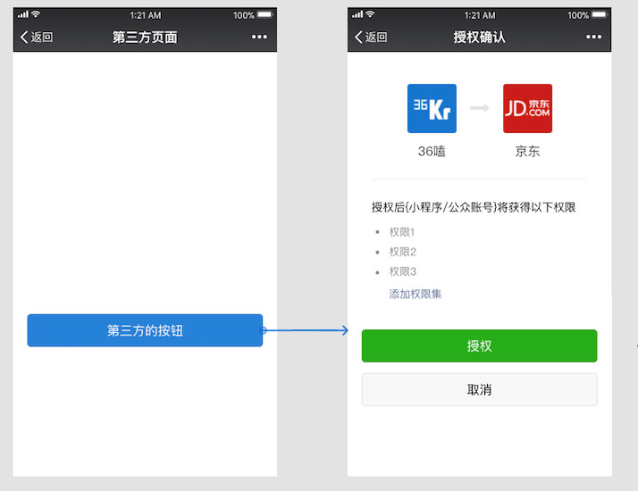

# 浅析 OAuth 2.0

我接触 web 开发以来，但凡是使用第三方的服务，似乎都是用的 OAuth2。刚开始做 web 开发，最常遇到的功能模块就是「QQ 第三方登录 」、「微信第三方登录」、「支付宝第三方登录」等等，写的多了发现各家的接口类似，接口文档更类似，高度的统一有木有，所以为此自己还特地写了一个聚合插件，提高自己的工作效率。

注：以下所有 Ascii Flow 均来自[官方 RFC 6749](https://tools.ietf.org/html/rfc6749)

## 简单介绍
首先我得明白它是用来解决什么问题的：在给客户端开放受限制的资源访问时，如果使用传统的客户端-服务端的认证模型，势必需要分享完整的授权凭证给客户端，而这会导致如下几个问题。
1. 客户端需要保存资源拥有者的凭证作为访问资源之用，典型的就是保存明文密码，从而导致密码泄露等安全问题，毕竟无法控制客户端如何妥善保存该凭证。
2. 客户端对于该资源的权限过大，无法限制访问的有效期和能访问的范围大小。
3. 无法限制特定客户端的访问权限，因为发放的凭证都是同一个，一改全都失效了，调控粒度太粗了。

OAuth2 的解决办法：**通过引入授权层的概念，将客户端和资源所有者的角色分开。通过签发拥有一系列不同访问权限的凭证代替资源所有者的完整权限的凭证。**

## 角色
OAuth 定义了四类角色：
- 资源所有者 Resource Owner
- 资源服务器 Resource Server
- 授权服务器 Authorization Server
- 客户端 Client

### 资源所有者：用户
用户授权给第三方 App 一些特定权限，以此访问我们的账号来获取信息。

### 资源服务器、授权服务器
资源服务器保管着我们的用户信息，授权服务器则负责验证用户凭证，然后签发 Access Token 给客户端。从客户端的开发者角度来看，这两者通常是同一个角色来扮演的。所以我们更愿意将这两者合并成一个角色——服务方。

### 客户端：第三方应用
需要获取用户信息的客户端，在获取用户信息前，必须通过用户授权，且授权凭证必须合法。

****
举个例子：比如我们在打开一个未授权过的微信服务号的网页时，通常会弹出一个授权框，上面一般会写着「xxx需要获取以下信息：你的公开信息（昵称、头像等）」。如果用户觉得这些数据可以被这个客户端获取，那么就点击确认授权按钮，此时该网页就能够获取到你在微信上的昵称、头像等你**授权可以访问的信息**。

以上例子中，资源所有者就是用户自己（这里的资源也就是用户的头像、昵称等信息，所以这些资源的所有权是属于用户的），资源服务器和授权服务器是微信平台，客户端就是这个微信服务号的网页应用。

具体流程如下图所示

```
     +--------+                               +---------------+
     |        |--(A)- Authorization Request ->|   Resource    |
     |        |                               |     Owner     |
     |        |<-(B)-- Authorization Grant ---|               |
     |        |                               +---------------+
     |        |
     |        |                               +---------------+
     |        |--(C)-- Authorization Grant -->| Authorization |
     | Client |                               |     Server    |
     |        |<-(D)----- Access Token -------|               |
     |        |                               +---------------+
     |        |
     |        |                               +---------------+
     |        |--(E)----- Access Token ------>|    Resource   |
     |        |                               |     Server    |
     |        |<-(F)--- Protected Resource ---|               |
     +--------+                               +---------------+

                     Figure 1: Abstract Protocol Flow

```

我们大致走一遍整个过程：

1. 客户端向用户发起授权请求
2. 用户确认授权，此时授权服务器会签发给客户端一个 Ticket (Authorization Code
)
3. 客户端拿着这个 Ticket 以及「自身的凭证」向授权服务器换取 Access Token
4. 授权服务器验证 Ticket 的合法性，验证通过则签发对应权限的 Access Token
5. 客户端拿着 Access Token 向资源服务器获取数据
6. 资源服务器验证 Access Token 的合法性，验证通过则返回相应数据

注：这里所说的「自身的凭证」指的是客户端在服务方注册应用得到的 AppID 和 AppSecret。比如你要在微信网页内获取微信用户的基本信息，那么你就得在微信公众平台上申请相应的服务号之类的。

## 应用注册
场景：还是以微信为例，应用A想接入微信的第三方登录。

在接入前，应用A需要在微信（服务方）开放平台上注册一个应用。填写一些相关信息，比如应用名称、应用 Logo、回调地址、应用域名等（不同服务方所需注册信息会有不同，但大体上都会需要这几个信息）。

注册成功后，微信开放平台会签发一对 AppID 和 AppSecret。前者是用来标识应用程序自己的，后者用于换取 Access Token 时的身份验证，需要妥善保存。

## 授权机制
官方协议提供了四种授权方式：
- Authorization Code Grant
- Implicit Grant
- Resource Owner Password Credentials Grant
- Client Credentials Grant

这里先只介绍最常用的一种授权方式：Authorization Code Grant。

这种方式是基于重定向的流模式。对用户来说就是点了一下确认授权按钮，然后剩下的就是客户端和授权服务器以及资源服务器三者之间你来我往的事情了，怎么来往呢，重定向呗。

```
     +----------+
     | Resource |
     |   Owner  |
     |          |
     +----------+
          ^
          |
         (B)
     +----|-----+          Client Identifier      +---------------+
     |         -+----(A)-- & Redirection URI ---->|               |
     |  User-   |                                 | Authorization |
     |  Agent  -+----(B)-- User authenticates --->|     Server    |
     |          |                                 |               |
     |         -+----(C)-- Authorization Code ---<|               |
     +-|----|---+                                 +---------------+
       |    |                                         ^      v
      (A)  (C)                                        |      |
       |    |                                         |      |
       ^    v                                         |      |
     +---------+                                      |      |
     |         |>---(D)-- Authorization Code ---------'      |
     |  Client |          & Redirection URI                  |
     |         |                                             |
     |         |<---(E)----- Access Token -------------------'
     +---------+       (w/ Optional Refresh Token)
 Note: The lines illustrating steps (A), (B), and (C) are broken into
   two parts as they pass through the user-agent.

                     Figure 3: Authorization Code Flow
```

### Step 1：构造获取授权码链接
我们首先需要拿到能换取 Access Token 的临时票据，通常是构造类似下面这个链接去获取：

`https://oauth.example.com/authorize?response_type=code&client_id=CLIENT_ID&redirect_uri=CALLBACK_URL&scope=SCOPE&state=STATE`

其中，
- 终端（Endpoint）：https://oauth.example.com/authorize，也就是服务方提供的授权API地址
- 请求类型（Response Type）：response_type=code，必填，期望返回的数据类型，这一步里值是固定的，即 code
- 应用唯一标识（Client ID）：client_id=CLIENT_ID，必填，让服务方识别出你是谁
- 回调地址（Redirect URI）：redirect_uri=CALLBACK_URL，必填，服务方签发授权码后重定向的地址，其中会携带这个授权码
- 作用域（Scope）：scope=SCOPE，选填，指出想要获取的资源类型
- 额外字段（State）：state=STATE，选填，用于保持请求和回调的状态，授权请求后原样带回给第三方。该参数可用于防止 csrf 攻击（跨站请求伪造攻击），建议第三方带上该参数。

**注：**选不选填不同平台都会有不同，比如微信第三方登录获取临时票据 CODE 的时候，scope 参数是必填的。

### Step 2：用户授权
当用户点击类似「微信登录」按钮的时候，实际上是点击了第一步构造好的链接，这个时候就会跳转到服务方的授权页面（我们假定用户在对应服务方平台上已经处于登录状态，否则会额外有一步登录服务方平台的操作，但跟我们这里无关），用户可以选择确认授权也可以拒绝授权，这两个行为最终都会通过服务方重定向回到客户端那里，只不过一个是带了 Authorization Code，一个没有。

下图来自微信开放平台，可以对照着看：

**注：**这里我们可以看到授权页面上出现的客户端的一些基本信息，也就是我们在服务方平台上注册应用的时候填写的信息。还需要注意的是**回调地址**，一般服务方都会强制要求注册应用的时候填写，然后在第一步中将注册应用时填写的回调地址和应用请求 Authorization Code API 时携带的回调地址进行比较，相同才能继续。为什么要这么做也很好理解，为了安全。（这个世界本来可以很简单，但为了安全，世界就变得复杂了）

### Step 3：客户端接收临时票据
我们假定用户确认授权了，此时服务方会将签发的临时票据携带在客户端的回调地址上，重定向到客户端，一般来讲，回调地址类似下面这样：

`https://www.xfly.one/oauth/callback?code=AUTHORIZATION_CODE`

客户端接受到这个请求后，就能拿到临时票据了。

**注：**Authorization Code 有效期很短，可能只有几分钟，且成功换取一次 Access Token 后即失效。这种临时性和一次性保障了授权的安全性。

### Step 4：客户端请求换取 Access Token
在拿到临时票据后，客户端赶紧拿着票据去换取 Access Token，同样的请求链接类似如下：

`https://oauth.example.com/oauth/token?client_id=CLIENT_ID&client_secret=CLIENT_SECRET&grant_type=authorization_code&code=AUTHORIZATION_CODE&redirect_uri=CALLBACK_URL`

其中，
- 客户端唯一标识（Client ID）：client_id=CLIENT_ID，必填，得和 code 参数进行匹配
- 客户端密钥（Client Secret）：client_secret=CLIENT_SECRET，必填，由于 Client ID 是公开的，仔细的你会发现前面几个步骤完全没有去验证是不是真的是这个客户端在请求获取用户信息，所以势必也需要验证客户端自己的身份。这里其实也可以灵活一些，也可以换成通过这个密钥生成包含其他参数的一个签名，然后在服务方那里去解密匹配
- 授予类型（Grant Type）：grant_type=authorization_code，必填，且值必须是 authorization_code
- 临时票据（Authorization Code）：code=AUTHORIZATION_CODE，必填，不多说
- 回调地址（Redirect URL）：redirect_uri=CALLBACK_URL，必填，不多说

**注：**这里的回调地址和上一步的回调地址意义不同（通常地址也不同）

这一步授权服务器必须进行如下几步：
1. 验证客户端的身份
2. 验证临时票据的合法性，包括验证是否是签发给该客户端的
3. 验证回调地址是否与注册应用时的回调地址保持一致

授权服务器验证通过以后就会将 Access Token 携带在回调地址上，并重定向会客户端。

### Step 5：客户端接收 Access Token
客户端接收到成功返回的请求，类似如下：
```
     HTTP/1.1 200 OK
     Content-Type: application/json;charset=UTF-8
     Cache-Control: no-store
     Pragma: no-cache

     {
       "access_token":"2YotnFZFEjr1zCsicMWpAA",
       "token_type":"example",
       "expires_in":3600,
       "refresh_token":"tGzv3JOkF0XG5Qx2TlKWIA",
       "example_parameter":"example_value"
     }
```

此时客户端就变身为**已授权应用**，可以获取对应权限的数据了！

## 刷新机制
我们会发现 Access Token 是有有效期的，过期了这个 Token 就废了。一开始我是没想明白的，为什么要多此一举。。。

既然给了 Refresh Token 用来不停刷新 Access Token，又何必将 Access Token 的有效期设置的这么短，直接设置长一点不就好了么。网上基本都是一个论调：这样对于前端的用户来说就不需要频繁进行授权操作了，对用户是无感知的。。。嗯，有点道理，但是还是一句话，把 Access Token 的过期时间设置得长一点不就好啦。。。

所以真正的问题是：Access Token 设置长期有效会有什么弊端？

**注：**长期有效也只是一个相对的概念，像微信 Access Token 的有效期是两小时，Refresh Token 的有效期是三十天，相对来说就是长期有效的。

我的理解如下：
首先我们要明白，为什么要有 Token 这玩意，不就是为了不必每一次调用接口都输入用户的账号和密码么！但 Token 不能取代用户的账号和密码，这就导致了 Token 这玩意的生命周期必然是短暂的（为什么不能取代，因为取代了用户的账号和密码的话就必须每次都携带这个 Token 来验证用户身份，那可就危险了，只要有某一次请求泄露了你的账号就没了，可怕不）。即便短暂了，但是我总不能眼睁睁看着我的 Token 泄露遭受恶意用户的疯狂输出，静静地等待着 Token 自己过期吧。所以， Token 除了生命周期需要相对短暂以外，还需要能被回收（废弃）。

附上刷新 Access Token 的流程图：

```
  +--------+                                           +---------------+
  |        |--(A)------- Authorization Grant --------->|               |
  |        |                                           |               |
  |        |<-(B)----------- Access Token -------------|               |
  |        |               & Refresh Token             |               |
  |        |                                           |               |
  |        |                            +----------+   |               |
  |        |--(C)---- Access Token ---->|          |   |               |
  |        |                            |          |   |               |
  |        |<-(D)- Protected Resource --| Resource |   | Authorization |
  | Client |                            |  Server  |   |     Server    |
  |        |--(E)---- Access Token ---->|          |   |               |
  |        |                            |          |   |               |
  |        |<-(F)- Invalid Token Error -|          |   |               |
  |        |                            +----------+   |               |
  |        |                                           |               |
  |        |--(G)----------- Refresh Token ----------->|               |
  |        |                                           |               |
  |        |<-(H)----------- Access Token -------------|               |
  +--------+           & Optional Refresh Token        +---------------+

               Figure 2: Refreshing an Expired Access Token

```

## 参考链接
-  [https://tools.ietf.org/html/rfc6749](https://tools.ietf.org/html/rfc6749) 
-  [https://www.digitalocean.com/community/tutorials/an-introduction-to-oauth-2](https://www.digitalocean.com/community/tutorials/an-introduction-to-oauth-2) 
-  [https://open.weixin.qq.com/cgi-bin/showdocument?action=dir_list&t=resource/res_list&verify=1&id=open1419316505&token=&lang=zh_CN](https://open.weixin.qq.com/cgi-bin/showdocument?action=dir_list&t=resource/res_list&verify=1&id=open1419316505&token=&lang=zh_CN) 
